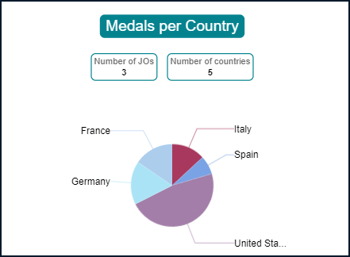
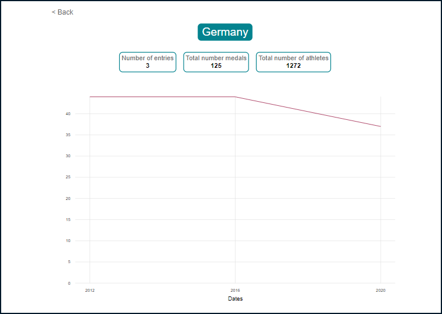

# OlympicGames

OlympicGames displays statistics through charts on countries engagement and performances during different Olympic Games editions.

This project is used to pass OpenClassrooms's course : "Développer
le front-end en utilisant Angular"

It is built on the [starting code](https://github.com/OpenClassrooms-Student-Center/Developpez-le-front-end-en-utilisant-Angular) provided by OpenClassrooms.

This project was generated with [Angular CLI](https://github.com/angular/angular-cli) version 14.1.3.
Don't forget to install your node_modules before starting (`npm install`).

(Home)

(Detail)

## Technologies

- Typescript
- SCSS
- Angular

## Libraries

- [ngx-charts](https://swimlane.github.io/ngx-charts/#/ngx-charts/bar-vertical)

## Development server

Run `ng serve` for a dev server. Navigate to `http://localhost:4200/`. The application will automatically reload if you change any of the source files.

## Build

Run `ng build` to build the project. The build artifacts will be stored in the `dist/` directory.

## Authors

[dpnick](https://github.com/dpnick) (starting code), [Adam QUEVAL](https://github.com/QuevalA).

## Licensing

This project was built under the Creative Commons licence.
